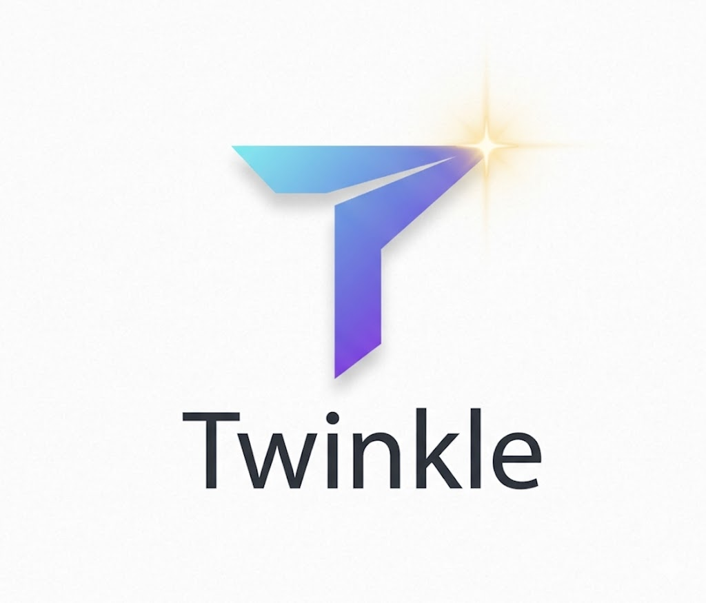
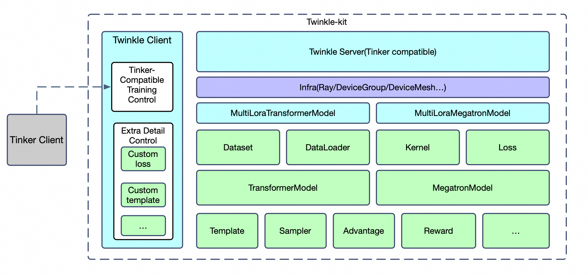
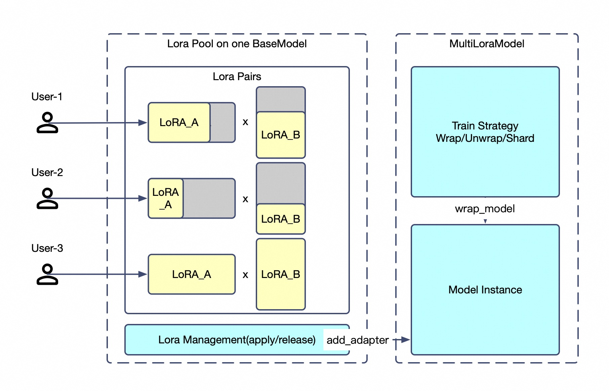

---
title: 'Twinkle'
date: 2026-02-10
type: landing

design:
  spacing: "3rem"

sections:
  # ═══════════════════════════════════════════════════════════════════════════
  # HERO - Dramatic entrance
  # ═══════════════════════════════════════════════════════════════════════════
  - block: hero
    content:
      title: '<span class="hero-title-with-logo"></span>'
      text: |
        <p style="font-size: 1.5rem; font-weight: 500; margin-bottom: 0.5rem;">Training workbench to make your model glow ✨</p>
        <p style="font-size: 1.1rem; color: #64748b;">One framework. Any scale. From your laptop to thousand-GPU clusters.</p>
      primary_action:
        text: Get Started
        url: docs/getting-started/
        icon: rocket-launch
      secondary_action:
        text: View Source
        url: https://github.com/modelscope/twinkle
      announcement:
        text: "🚀 v0.4.0 — DeepSeek V4, Gemma 4, Qwen3.5 MoE GatedDeltaNet, EP LoRA & NPU Acceleration"
        link:
          text: "See what's new →"
          url: "https://github.com/modelscope/twinkle/releases/tag/v0.4.0"
    design:
      spacing:
        padding: ["5rem", 0, "3rem", 0]

  # ═══════════════════════════════════════════════════════════════════════════
  # STATS - Key numbers at a glance
  # ═══════════════════════════════════════════════════════════════════════════
  - block: stats
    content:
      items:
        - statistic: "All Modalities"
          description: |
            Mainstream Models
            LLM · VLM · MoE
        - statistic: "3 Modes"
          description: |
            Local · Ray · Client
        - statistic: "TaaS"
          description: |
            Parallel LoRA Training
        - statistic: "<5min"
          description: |
            Setup Time
            pip install & go
        - statistic: "OpenAI"
          description: |
            Compatible API
            /chat/completions
        - statistic: "Auto Research"
          description: |
            LLM Agent Powered
            Natural Language · End-to-End
        - statistic: "OpenEnv"
          description: |
            RL Environments
            Multi-turn Rollout
    design:
      spacing:
        padding: ["2rem", 0, "2rem", 0]

  # ═══════════════════════════════════════════════════════════════════════════
  # WHAT IS TWINKLE - Core value prop
  # ═══════════════════════════════════════════════════════════════════════════
  - block: markdown
    content:
      title: ""
      text: |
        <div style="max-width: 800px; margin: 0 auto; text-align: center; padding: 2rem 0;">
        
        ## What is Twinkle?
        
        Twinkle is a **client-server LLM training framework** that separates *what you train* from *how you train*. 
        
        Write your training logic once with clean Python APIs. Then deploy it anywhere — locally with `torchrun`, 
        across Ray clusters, or as serverless Training-as-a-Service.
        
        </div>
    design:
      columns: '1'
      spacing:
        padding: ["1rem", 0, "2rem", 0]

  # ═══════════════════════════════════════════════════════════════════════════
  # CODE EXAMPLE - Show don't tell
  # ═══════════════════════════════════════════════════════════════════════════
  - block: markdown
    content:
      title: ""
      text: |
        <div style="max-width: 800px; margin: 0 auto;">
        
        ## Train in 20 Lines
        
        ```bash
        pip install 'twinkle-kit[ray]'
        ```
        
        ```python
        import twinkle
        from peft import LoraConfig
        from twinkle import DeviceGroup
        from twinkle.dataloader import DataLoader
        from twinkle.dataset import Dataset, DatasetMeta
        from twinkle.model import TransformersModel
        
        # Choose your runtime: 'local' (torchrun), 'ray', or 'http'
        twinkle.initialize(mode='ray', groups=[DeviceGroup(name='default', ranks=8)])
        
        # Prepare data — works with ModelScope and Hugging Face
        dataset = Dataset(dataset_meta=DatasetMeta('ms://swift/self-cognition'))
        dataset.set_template('Qwen3_5Template', model_id='ms://Qwen/Qwen3.5-4B')
        dataset.encode()
        
        # Create model with LoRA
        model = TransformersModel(model_id='ms://Qwen/Qwen3.5-4B', remote_group='default')
        model.add_adapter_to_model('default', LoraConfig(r=8, lora_alpha=32))
        model.set_optimizer(optimizer_cls='AdamW', lr=1e-4)
        
        # Train — you control the loop
        for batch in DataLoader(dataset=dataset, batch_size=8):
            model.forward_backward(inputs=batch)
            model.clip_grad_and_step()
        
        model.save('my-finetuned-model')
        ```
        
        ### Or train via ModelScope TaaS — no GPU required
        
        ```python
        import os
        from twinkle import init_tinker_client
        from twinkle.dataloader import DataLoader
        from twinkle.dataset import Dataset, DatasetMeta
        from twinkle.preprocessor import SelfCognitionProcessor
        from twinkle.server.common import input_feature_to_datum
        
        # Use ModelScope's official TaaS endpoint — free, no local GPU needed
        base_url = 'https://www.modelscope.cn/twinkle'
        api_key = os.environ.get('MODELSCOPE_TOKEN')
        base_model = 'Qwen/Qwen3.6-27B'
        
        # Prepare data locally
        dataset = Dataset(dataset_meta=DatasetMeta('ms://swift/self-cognition'))
        dataset.set_template('Qwen3_5Template', model_id=f'ms://{base_model}', max_length=256)
        dataset.map(SelfCognitionProcessor('My Model', 'My Team'))
        dataset.encode(batched=True)
        
        # Connect to ModelScope TaaS
        init_tinker_client()
        from tinker import ServiceClient, types
        
        service_client = ServiceClient(base_url=base_url, api_key=api_key)
        training_client = service_client.create_lora_training_client(
            base_model=base_model, rank=16
        )
        
        # Train — same loop, running on ModelScope's cluster
        for batch in DataLoader(dataset=dataset, batch_size=8):
            training_client.forward_backward(
                [input_feature_to_datum(f) for f in batch], 'cross_entropy'
            )
            training_client.optim_step(types.AdamParams(learning_rate=1e-4))
        
        training_client.save_state('my-lora').result()
        ```
        
        </div>
    design:
      columns: '1'
      css_class: "bg-gray-50"
      spacing:
        padding: ["3rem", 0, "3rem", 0]

  # ═══════════════════════════════════════════════════════════════════════════
  # ARCHITECTURE - Visual showcase
  # ═══════════════════════════════════════════════════════════════════════════
  - block: markdown
    content:
      title: ""
      text: |
        <div style="text-align: center; padding: 2rem 0;">
          
        </div>
        
        <div style="display: grid; grid-template-columns: repeat(auto-fit, minmax(250px, 1fr)); gap: 2rem; max-width: 900px; margin: 2rem auto;">
          <div style="text-align: center;">
            <h4 style="color: #6366f1; margin-bottom: 0.5rem;">🔌 Triple API</h4>
            <p style="font-size: 0.9rem; opacity: 0.8;">OpenAI-compatible /chat/completions, native Twinkle API, or Tinker-compatible API</p>
          </div>
          <div style="text-align: center;">
            <h4 style="color: #6366f1; margin-bottom: 0.5rem;">🧩 Modular</h4>
            <p style="font-size: 0.9rem; opacity: 0.8;">25+ components: Dataset, Template, Model, Sampler, Loss, Reward, Metric...</p>
          </div>
          <div style="text-align: center;">
            <h4 style="color: #6366f1; margin-bottom: 0.5rem;">🔀 Backend Agnostic</h4>
            <p style="font-size: 0.9rem; opacity: 0.8;">Transformers or Megatron — switch with one config change</p>
          </div>
        </div>
    design:
      columns: '1'
      css_class: "bg-gray-50"
      spacing:
        padding: ["3rem", 0, "3rem", 0]

  # ═══════════════════════════════════════════════════════════════════════════
  # FEATURES - Why Twinkle
  # ═══════════════════════════════════════════════════════════════════════════
  - block: features
    id: features
    content:
      title: Why Twinkle?
      text: ""
      items:
        - name: Scale Without Rewriting
          icon: arrow-trending-up
          description: |
            Same interface runs on your laptop and on thousand-GPU clusters. Switch from `torchrun` to Ray to HTTP deployment without changing your training logic.
        - name: Multi-Tenancy Built-In
          icon: users
          description: |
            Train N different LoRAs on one base model simultaneously. Each tenant gets isolated optimizer, data pipeline, and loss function — sharing only compute.
        - name: You Own the Loop
          icon: code-bracket
          description: |
            No hidden magic. See and control every forward, backward, and optimizer step. Compose algorithms freely, customize completely.
        - name: Training as a Service
          icon: cloud-arrow-up
          description: |
            Built for production TaaS deployments with automated cluster management, dynamic scaling, and enterprise multi-tenant isolation.
        - name: All Training Methods
          icon: academic-cap
          description: |
            SFT, pre-training, GRPO, GKD, and more. Dense models and MoE architectures. Full FSDP, tensor parallelism, pipeline parallelism support.
        - name: Broad Model Support
          icon: cpu-chip
          description: |
            Qwen 3.6/3.5/3/2.5, DeepSeek R1/V2, GLM-4, InternLM2, and more. Both Hugging Face and ModelScope model hubs.
    design:
      spacing:
        padding: ["3rem", 0, "3rem", 0]

  # ═══════════════════════════════════════════════════════════════════════════
  # MULTI-TENANCY - Killer feature
  # ═══════════════════════════════════════════════════════════════════════════
  - block: markdown
    content:
      title: ""
      text: |
        <div style="max-width: 900px; margin: 0 auto;">
        
        ## Multi-Tenancy: N Jobs, 1 Base Model
        
        <div style="text-align: center; margin: 2rem 0;">
          
        </div>
        
        Run completely different training jobs on a shared deployment:
        
        | Tenant | Setup | Task |
        |:------:|-------|------|
        | **A** | LoRA r=8, private data | SFT fine-tuning |
        | **B** | LoRA r=32, Hub dataset | Continued pre-training |
        | **C** | GRPO loss + Sampler | Reinforcement learning |
        | **D** | Inference mode | Log-prob computation |
        
        Each tenant is **fully isolated** — different optimizers, data pipelines, loss functions. 
        They only share the base model's compute. Checkpoints auto-sync to ModelScope or Hugging Face.
        
        </div>
    design:
      columns: '1'
      spacing:
        padding: ["3rem", 0, "3rem", 0]

  # ═══════════════════════════════════════════════════════════════════════════
  # SUPPORTED MODELS - Social proof
  # ═══════════════════════════════════════════════════════════════════════════
  - block: markdown
    content:
      title: ""
      text: |
        <div style="text-align: center; padding: 2rem 0;">
        
        ## Supported Models
        
        <div style="margin: 1.5rem 0;">
          <span class="model-tag" style="background: linear-gradient(135deg, #ec4899 0%, #db2777 100%);">Qwen 3.6</span>
          <span class="model-tag" style="background: linear-gradient(135deg, #6366f1 0%, #4f46e5 100%);">Qwen 3.5</span>
          <span class="model-tag" style="background: linear-gradient(135deg, #8b5cf6 0%, #7c3aed 100%);">Qwen 2.5</span>
          <span class="model-tag" style="background: linear-gradient(135deg, #3b82f6 0%, #2563eb 100%);">DeepSeek R1 / V4</span>
          <span class="model-tag" style="background: linear-gradient(135deg, #f59e0b 0%, #d97706 100%);">LLaMA 3</span>
          <span class="model-tag" style="background: linear-gradient(135deg, #10b981 0%, #059669 100%);">GLM-4</span>
          <span class="model-tag" style="background: linear-gradient(135deg, #14b8a6 0%, #0d9488 100%);">InternLM 2.5</span>
          <span class="model-tag" style="background: linear-gradient(135deg, #6b7280 0%, #4b5563 100%);">Mistral</span>
          <span class="model-tag" style="background: linear-gradient(135deg, #06b6d4 0%, #0891b2 100%);">Yi</span>
        </div>
        <div style="margin: 1rem 0;">
          <span class="model-tag" style="background: linear-gradient(135deg, #a855f7 0%, #9333ea 100%);">Qwen VL</span>
          <span class="model-tag" style="background: linear-gradient(135deg, #64748b 0%, #475569 100%);">InternVL</span>
          <span class="model-tag" style="background: linear-gradient(135deg, #78716c 0%, #57534e 100%);">Qwen Embedding</span>
        </div>
        
        <p style="opacity: 0.7; font-size: 0.9rem;">
          Works with mainstream LLMs & VLMs · NVIDIA · Ascend NPU · SFT / PT / GRPO / GKD / Embedding
        </p>
        
        </div>
    design:
      columns: '1'
      css_class: "bg-gray-50"
      spacing:
        padding: ["2rem", 0, "2rem", 0]

  # ═══════════════════════════════════════════════════════════════════════════
  # CTA - Final push
  # ═══════════════════════════════════════════════════════════════════════════
  - block: cta-card
    content:
      title: "Ready to make your model glow?"
      text: |
        Install Twinkle and start training in under 5 minutes.
      button:
        text: Quick Start →
        url: docs/getting-started/
    design:
      card:
        css_class: "bg-primary-700"
---
